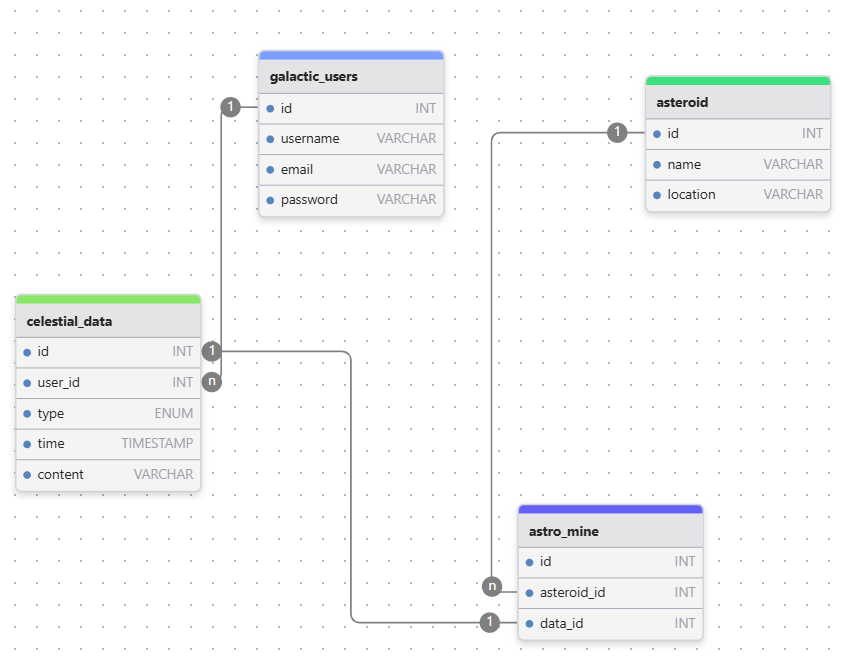

# Proyecto de bases de datos de tienda
## 🛠 Descripción del proyecto
El proyecto es una recopilación de código sql para la creación de las tablas, consultas sql e inserción de datos
## 👨‍👩‍👧‍👦 miembros de equipo
1. Juan Perez
2. María Gonzáles
3. Pedro Cáceres
## 🚀 Diagrama de la bases de datos

> [!NOTE]
> Información remarcada
